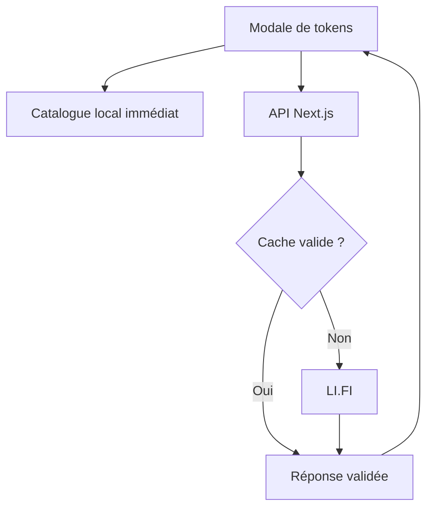

# Architecture Hermes

Hermes utilise Next.js 14 App Router, React 18, TypeScript, wagmi/viem,
RainbowKit, le SDK LI.FI 4.7 et son fournisseur d'exécution Ethereum officiel,
ainsi que l'API Basic Rango pour l'EVM.
Les réseaux EVM de `lib/chains.ts` sont la référence commune à la
découverte, au wallet et aux contrôles des métadonnées.

## Recherche de tokens — option B

La modale affiche les tokens principaux de `lib/tokens/catalog.ts` dès son ouverture,
sans requête API. Les réseaux et la paire initiale sont aussi configurés localement.
Une saisie filtre ces entrées immédiatement et déclenche une recherche LI.FI après
300 ms, sauf pour une adresse exacte déjà au catalogue. Le bouton de parcours
élargi permet aussi de charger la liste distante sans saisir de nom.
Changer la saisie, le réseau ou fermer la
modale annule la requête et invalide immédiatement ses résultats et son consentement.

### Contrat HTTP

`GET /api/tokens/search` est une route dynamique Node.js :

| Paramètre | Valeurs |
| --- | --- |
| `chainId` | Identifiant décimal d'un réseau EVM configuré, obligatoire. |
| `query` | Nom, symbole ou adresse EVM ; vide pour les tokens populaires ; 100 caractères maximum. |
| `limit` | 25 (défaut), 50, 100 ou 200. |
| `fresh` | 0 (défaut) ou 1 ; 1 exige une adresse exacte et contourne le cache local. |

La réponse contient `chainId`, `query`, `tokens`, `limit`, `hasMore`, `truncated`, `checkedAt`.
Les erreurs publiques sont 400 (entrée invalide), 429 (quota/concurrence, avec
`Retry-After: 60`) ou 503 (vérification indisponible). Une réponse
LI.FI 404 pour une adresse exacte devient une liste vide. Les autres erreurs ne
sont jamais converties en une fausse absence de token ni exposées avec leurs
détails privés. Toutes les réponses HTTP utilisent `Cache-Control: no-store`.

### Service serveur

`lib/tokens/search.server.ts` porte la frontière `server-only`
et crée un client LI.FI sans wallet. Il lit `LIFI_API_KEY` uniquement
sur le serveur. Les demandes de liste utilisent `getTokens` avec réseau,
type EVM, recherche textuelle, `minPriceUSD: 0`, tri market cap et
`limit + 1` pour détecter la troncature. Une adresse passe par
`getToken`, sans fallback CoinGecko ou RPC.

Les limites de résultats servent à l'affichage, pas à constituer une allowlist :
la recherche exacte reste accessible au-delà des 200 premiers résultats.

| Limite locale | Valeur |
| --- | --- |
| Cache | 256 entrées maximum, TTL 60 s ; résultat vide 10 s. |
| Appels simultanés | 8 ; requêtes identiques regroupées. |
| Budget d'appels LI.FI | 60/minute par défaut, configurable entre 1 et 1000. |
| Timeout LI.FI | 8 s, sans retry automatique. |
| Timeout du client HTTP | 10 s, associé au signal d'annulation. |

Ces limites sont en mémoire **par processus**, et ne constituent pas un quota
global entre instances ou régions. Un cache et un compteur partagés, ou une limite
en amont, pourront être ajoutés pour un déploiement distribué. Les cotations SDK
navigateur ne passent pas par ce service.

### Validation et consentement

`lib/tokens/validation.ts` vérifie réseau/adresse, décimales entières
0–255, noms et symboles bornés, puis copie uniquement les champs utiles. Les logos
externes doivent être des URL HTTPS. Les logos du catalogue sont des SVG locaux,
livrés dans `public/tokens/` et sélectionnés par réseau/adresse (`TOKEN_LOGOS.md`).
L'identité est `chainId:adresse-en-minuscules` ;
le symbole n'est jamais une clé de déduplication.

Le verdict le plus restrictif prévaut : un résultat `flagged`, y compris
dans le détail d'un fournisseur ou un doublon, bloque le token. Un statut absent
ou `unverified` exige, hors catalogue local, une confirmation avec contrat complet, réseau et
explorateur. Le consentement `riskAcknowledged` reste dans la sélection
locale et n'est jamais accepté dans les données reçues de l'API. Changer de
recherche ou réseau efface le panneau et sa case de confirmation.

Le catalogue local épingle les actifs natifs et une sélection d'ERC-20 par réseau,
adresse, décimales et symbole. Il est versionné ; aucune réponse API ne peut l'étendre.
Ces actifs sont exemptés de consentement d'import et de requête d'authenticité.
Le statut affiché « Catalogue Hermes » est distinct du verdict LI.FI. Un signalement
reçu dans une recherche ou la cotation reste prioritaire. Les copies d'une entrée
renvoyées aux appelants ne permettent pas de modifier les données épinglées.
Voir `TOKEN_CATALOG.md` pour la liste et les sources. Aucun prix n'est inventé :
`priceUSD: "0"` signifie qu'aucun prix n'est encore disponible.

## Cotations et exécution

Les cotations LI.FI passent par le SDK navigateur ; celles de Rango passent par
un proxy Next.js avec clé serveur. Les deux recherches sélectionnées démarrent
en parallèle avec timeout 15 s. Une panne de provider n'efface pas les routes de
l'autre ; l'interface signale la disponibilité partielle. Socket reste désactivé.
Le service `lib/routing/` normalise, déduplique par ID/provider et trie les routes par
montant net décroissant. La clé de cotation lie compte, chaînes, adresses et montant.
Les réponses périmées sont ignorées et les cotations expirent au bout de 30 s.
La sélection des providers fait aussi partie de la clé de requête du hook.
`useSwapQuotes` planifie alors une nouvelle requête immédiatement. Les anciennes
routes restent affichées mais sont désactivées pendant le renouvellement. Une
réponse échouée, vide ou déjà expirée programme une tentative après 15 s ; elle
ne réactive pas une route périmée. Une seule requête peut être active par cycle.
La fonction tient compte de l'heure réelle au retour d'un onglet masqué ou à la
reconnexion. Le timer et les listeners sont nettoyés lors d'un changement de
paramètres, de la fermeture du composant ou de la suspension pour exécution.

`QuoteCountdown` affiche les secondes jusqu'à la prochaine échéance, un anneau
qui se vide et une animation pendant la recherche. Les préférences de mouvements
réduits sont respectées ; le lecteur d'écran n'annonce pas chaque seconde.
L'actualisation automatique n'appelle jamais le wallet ni la fonction d'exécution.

L'orchestrateur publie les résultats de chaque provider dès leur arrivée. Le hook
affiche ces routes pendant que les autres recherches continuent, sans permettre
l'exécution avant la fin du cycle. L'annulation bloque aussi les résultats partiels.
Les cartes mettent en avant montant reçu, durée, gas et minimum ; les frais
additionnels sont signalés et le détail des montants/contrats reste dépliable.
Les listes de réseaux avec logos sont accessibles au clavier. Le choix USD/EUR
est mémorisé localement ; EUR reste indisponible sans taux de référence valide.

Avant toute action du wallet, `executeSwapQuote` :

1. vérifie le compte, les paramètres et l'expiration de la cotation ;
2. compare l'identité et les décimales de la sélection avec les tokens du devis ;
3. refuse les signalements connus et les imports sans consentement ;
4. compare les actifs locaux à leurs métadonnées épinglées ; relit les autres
   tokens avec `fresh=1`, puis refuse une indisponibilité, un signalement, des
   métadonnées différentes ou un nouveau besoin de consentement ;
5. revérifie le compte après cette attente, active le réseau source si nécessaire,
   contrôle les soldes ERC-20/natif et réserve le gas ;
6. revérifie la cotation et le compte, puis choisit l'exécuteur par provider :
   SDK EVM LI.FI ou préparation/signature/suivi Rango. Les payloads sont distincts.

Le wallet client est récupéré depuis wagmi au moment de l'action. Les changements
automatiques de taux sont refusés ; les signatures restent demandées par le wallet.
Une nouvelle requête locale ne garantit pas un nouveau scan chez LI.FI : leurs
verdicts peuvent être mis en cache et ne constituent pas une garantie de sécurité.

### Rango Basic API

`POST /api/rango/{quote,swap,status}` accepte uniquement des entrées bornées et
validées. L'hôte est fixe selon la clé publique de test ou privée, jamais issu du
client ; les clés et détails d'erreur privés restent au serveur. Des budgets
séparés par processus protègent les cotations, préparations et suivis.

La transaction finale conserve le protocole, les tokens, le compte et le minimum
sélectionnés. Aucun frais coté ne peut augmenter automatiquement. L'exécuteur
accepte uniquement EVM, valeur exacte et approval limitée au principal, attend
la receipt d'approval puis reconstruit la transaction. Les contrôles de compte,
chaîne et validité sont répétés après les attentes, puis le gas et les soldes
sont estimés à nouveau avant signature.

Le suivi distingue l'envoi source de la livraison finale. Timeout ou résultat
incomplet signifie « en attente », pas échec autorisant un renvoi. Le hash et le
requestId sont conservés en local pour une reprise après rechargement ; les
nouveaux swaps sont bloqués pendant cette attente. Aucune reprise ne signe.
Voir [RANGO_INTEGRATION.md](./RANGO_INTEGRATION.md) pour les limites et références.

## Montants et prix

`lib/amounts.ts` convertit la saisie avec `BigInt` et accepte
une virgule ou un point décimal. Les entiers LI.FI restent des chaînes ; exposants,
signes, séparateurs de milliers et excès de décimales sont rejetés.

Les frais plateforme sont configurables, avec slippage 0,5 % et impact maximal
5 % chez LI.FI ; Rango refuse les verdicts d'impact élevé de son API.
Rango exige un destinataire de commission pour des frais non nuls et accepte
au maximum 3 %. Le montant net, le minimum reçu et les frais réseau restent distincts.
Les prix USD passent aussi par le service tokens, par réseau/adresse. Le taux EUR
vient de la BCE via Frankfurter, avec sa date et un repli sur USD si indisponible.
Ces demandes de prix sont indépendantes de l'authenticité : leur échec ne retire
pas une entrée du catalogue local et ne bloque pas sa sélection.

## Configuration et modules

| Emplacement ou variable | Responsabilité |
| --- | --- |
| `LIFI_API_KEY` | Clé optionnelle privée du service tokens ; remplace l'ancienne variable publique. |
| `TOKEN_SEARCH_REQUESTS_PER_MINUTE` | Budget local d'appels du service tokens. |
| `NEXT_PUBLIC_PLATFORM_FEE_PERCENT` | Frais Hermes 0–100. |
| `RANGO_API_KEY` | Clé serveur privée facultative ; clé publique de test par défaut. |
| `RANGO_REFERRER_ADDRESS` | Commission Rango non nulle (plafond 3 %). |
| `lib/aggregators/rango/` | Validation API, signature EVM et suivi séparés de LI.FI. |
| `lib/tokens/client.ts` | HTTP navigateur et validation des réponses. |
| `lib/tokens/catalog.ts` | Métadonnées locales épinglées et recherche synchrone. |
| `lib/contractTokenResolver.ts` | Wrapper de résolution LI.FI par adresse ; aucun fallback RPC. |
| `lib/aggregators/lifi/client.ts` | SDK navigateur et fournisseur EVM, sans clé privée. |
| `lib/routing/execute.ts` | Contrôles avant exécution. |
| `components/TokenSelectModal.tsx` | Recherche, consentement, focus trap et scroll. |
| `components/QuoteCountdown.tsx` | Compteur d'expiration et états de renouvellement. |
| `next.config.js` | Imports optimisés de `viem/chains`, sans les modules Tempo inutilisés. |

L'import global de `viem/chains` entraînait `tempo/VirtualMaster` et son import
dynamique de workers Node dans le bundle de l'API. `optimizePackageImports` conserve
uniquement les exports nécessaires, corrigeant le warning `Critical dependency`
sans patcher `node_modules`, changer de version ou filtrer les diagnostics.

## Vérifications et limites

Exécuter `npm run typecheck`, `npm test`, `npm run lint` et `npm run build`.
Les tests contrôlent les paramètres API, homonymes, cache, quotas, erreurs, consentement,
réponses tardives, métadonnées avant signature et protections de cotation existantes.
Ils couvrent également l'exemption exacte du catalogue, les homonymes malveillants,
l'actualisation automatique, les délais de retry, la suspension et le compte à rebours.
Ils ne déplacent pas de fonds.

Socket, wallets non-EVM, scan GoPlus, scoring des bridges et orchestration
entièrement serveur restent hors périmètre. Rango est en bêta, limité aux
transactions EVM acceptées par son validateur. Le parcours signé complet reste
à vérifier manuellement. La disponibilité d'une route dépend des providers,
de leurs quotas, de la liquidité et du montant demandé.
