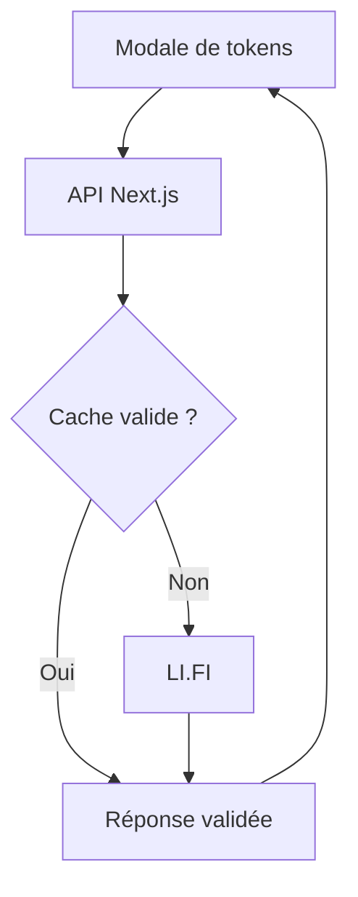

# Architecture Hermes

Hermes utilise Next.js 14 App Router, React 18, TypeScript, wagmi/viem,
RainbowKit, le SDK LI.FI 4.7 et son fournisseur d'exécution Ethereum officiel.
Les réseaux EVM de `lib/chains.ts` sont la référence commune à la
découverte, au wallet et aux contrôles des métadonnées.

## Recherche de tokens — option B

La modale charge les tokens populaires du réseau actif à son ouverture. Une saisie
déclenche la recherche après 300 ms ; changer la saisie, le réseau ou fermer la
modale annule la requête et invalide immédiatement ses résultats et son consentement.

### Contrat HTTP

`GET /api/tokens/search` est une route dynamique Node.js :

| Paramètre | Valeurs |
| --- | --- |
| `chainId` | Identifiant décimal d'un réseau EVM configuré, obligatoire. |
| `query` | Nom, symbole ou adresse EVM ; vide pour les tokens populaires ; 100 caractères maximum. |
| `limit` | 25 (défaut), 50, 100 ou 200. |
| `fresh` | 0 (défaut) ou 1 ; 1 exige une adresse exacte et contourne le cache local. |

La réponse contient `chainId`, `query`, `tokens`, `limit`, `hasMore`, `truncated`, `checkedAt`.
Les erreurs publiques sont 400 (entrée invalide), 429 (quota/concurrence, avec
`Retry-After: 60`) ou 503 (vérification indisponible). Une réponse
LI.FI 404 pour une adresse exacte devient une liste vide. Les autres erreurs ne
sont jamais converties en une fausse absence de token ni exposées avec leurs
détails privés. Toutes les réponses HTTP utilisent `Cache-Control: no-store`.

### Service serveur

`lib/tokens/search.server.ts` porte la frontière `server-only`
et crée un client LI.FI sans wallet. Il lit `LIFI_API_KEY` uniquement
sur le serveur. Les demandes de liste utilisent `getTokens` avec réseau,
type EVM, recherche textuelle, `minPriceUSD: 0`, tri market cap et
`limit + 1` pour détecter la troncature. Une adresse passe par
`getToken`, sans fallback CoinGecko ou RPC.

Les limites de résultats servent à l'affichage, pas à constituer une allowlist :
la recherche exacte reste accessible au-delà des 200 premiers résultats.

| Limite locale | Valeur |
| --- | --- |
| Cache | 256 entrées maximum, TTL 60 s ; résultat vide 10 s. |
| Appels simultanés | 8 ; requêtes identiques regroupées. |
| Budget d'appels LI.FI | 60/minute par défaut, configurable entre 1 et 1000. |
| Timeout LI.FI | 8 s, sans retry automatique. |
| Timeout du client HTTP | 10 s, associé au signal d'annulation. |

Ces limites sont en mémoire **par processus**, et ne constituent pas un quota
global entre instances ou régions. Un cache et un compteur partagés, ou une limite
en amont, pourront être ajoutés pour un déploiement distribué. Les cotations SDK
navigateur ne passent pas par ce service.

### Validation et consentement

`lib/tokens/validation.ts` vérifie réseau/adresse, décimales entières
0–255, noms et symboles bornés, puis copie uniquement les champs utiles. Les logos
doivent être des URL HTTPS. L'identité est `chainId:adresse-en-minuscules` ;
le symbole n'est jamais une clé de déduplication.

Le verdict le plus restrictif prévaut : un résultat `flagged`, y compris
dans le détail d'un fournisseur ou un doublon, bloque le token. Un statut absent
ou `unverified` exige une confirmation avec contrat complet, réseau et
explorateur. Le consentement `riskAcknowledged` reste dans la sélection
locale et n'est jamais accepté dans les données reçues de l'API. Changer de
recherche ou réseau efface le panneau et sa case de confirmation.

L'actif natif configuré est reconnu par réseau + adresse zéro + décimales + symbole.
Il peut être proposé au démarrage sans importer de contrat ERC-20. Sa reconnaissance
LI.FI est tout de même vérifiée avant exécution. Aucune décimale ou valeur USD n'est
inventée à partir d'un symbole.

## Cotations et exécution

Les cotations restent demandées par le SDK navigateur, avec timeout 15 s. Le
service `lib/routing/` normalise, déduplique et trie les routes par
montant net décroissant. La clé de cotation lie compte, chaînes, adresses et montant.
Les réponses périmées sont ignorées et les cotations expirent au bout de 60 s.

Avant toute action du wallet, `executeSwapQuote` :

1. vérifie le compte, les paramètres et l'expiration de la cotation ;
2. compare l'identité et les décimales de la sélection avec les tokens du devis ;
3. refuse les signalements connus et les imports sans consentement ;
4. relit les deux tokens avec `fresh=1`, puis refuse une indisponibilité,
   un signalement, des métadonnées différentes ou un nouveau besoin de consentement ;
5. revérifie le compte après cette attente, active le réseau source si nécessaire,
   contrôle les soldes ERC-20/natif et réserve le gas ;
6. revérifie la cotation et le compte, puis confie l'exécution au fournisseur EVM LI.FI.

Le wallet client est récupéré depuis wagmi au moment de l'action. Les changements
automatiques de taux sont refusés ; les signatures restent demandées par le wallet.
Une nouvelle requête locale ne garantit pas un nouveau scan chez LI.FI : leurs
verdicts peuvent être mis en cache et ne constituent pas une garantie de sécurité.

## Montants et prix

`lib/amounts.ts` convertit la saisie avec `BigInt` et accepte
une virgule ou un point décimal. Les entiers LI.FI restent des chaînes ; exposants,
signes, séparateurs de milliers et excès de décimales sont rejetés.

Les frais plateforme sont configurables, avec slippage 0,5 % et impact maximal
5 %. Le montant net, le minimum reçu et les frais réseau restent distincts.
Les prix USD passent aussi par le service tokens, par réseau/adresse. Le taux EUR
vient de la BCE via Frankfurter, avec sa date et un repli sur USD si indisponible.

## Configuration et modules

| Emplacement ou variable | Responsabilité |
| --- | --- |
| `LIFI_API_KEY` | Clé optionnelle privée du service tokens ; remplace l'ancienne variable publique. |
| `TOKEN_SEARCH_REQUESTS_PER_MINUTE` | Budget local d'appels du service tokens. |
| `NEXT_PUBLIC_PLATFORM_FEE_PERCENT` | Frais Hermes 0–100. |
| `lib/tokens/client.ts` | HTTP navigateur et validation des réponses. |
| `lib/contractTokenResolver.ts` | Wrapper de résolution LI.FI par adresse ; aucun fallback RPC. |
| `lib/aggregators/lifi/client.ts` | SDK navigateur et fournisseur EVM, sans clé privée. |
| `lib/routing/execute.ts` | Contrôles avant exécution. |
| `components/TokenSelectModal.tsx` | Recherche, consentement, focus trap et scroll. |

## Vérifications et limites

Exécuter `npm run typecheck`, `npm test`, `npm run lint` et `npm run build`.
Les tests contrôlent les paramètres API, homonymes, cache, quotas, erreurs, consentement,
réponses tardives, métadonnées avant signature et protections de cotation existantes.
Ils ne déplacent pas de fonds.

Rango, Socket, wallets non-EVM, scan GoPlus, scoring des bridges et orchestration
serveur des cotations restent hors périmètre. La disponibilité d'une route dépend
de LI.FI, de la liquidité et du montant demandé.
